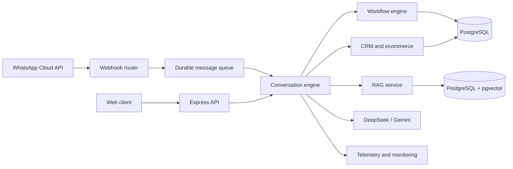

# Multilingual AI Agent Platform

A multi-tenant conversational AI platform for building account-scoped assistants across web and WhatsApp. It combines configurable workflows, retrieval-augmented generation (RAG), CRM and ecommerce capabilities, and operational telemetry in a TypeScript backend.

## Why this project exists

Businesses often need one assistant to answer policy questions, recommend products, qualify leads, collect structured information, and hand conversations to a human. This project brings those paths into one engine while keeping tenant and account data isolated.

## Core capabilities

- **Account-scoped RAG** - Ingests PDF knowledge sources, creates semantic chunks, stores vector embeddings in PostgreSQL with pgvector, and retrieves evidence within the correct tenant and account boundary.
- **Multilingual conversations** - Handles Arabic, Darija, French, and English, including RTL text normalization and multilingual query reformulation.
- **Multi-LLM routing** - Supports DeepSeek and Gemini through a provider abstraction with configurable models, timeouts, retries, and test doubles.
- **Workflow engine** - Runs configurable state-based conversations, validates collected fields, and controls workflow completion and retriggering.
- **WhatsApp integration** - Validates Meta webhooks, maps business numbers to accounts, queues inbound messages durably, prevents duplicate processing, and sends policy-aware outbound replies.
- **CRM and ecommerce** - Captures leads, keeps customer context, searches account-scoped product catalogs, and supports product recommendations.
- **Observability** - Tracks latency, token usage, retries, provider/model usage, and budget thresholds by tenant, account, domain, and intent.
- **Supporting services** - Includes a Gemini-powered image understanding service and a separate monitoring service with an admin interface.

## Architecture



## Technology

| Area | Technologies |
| --- | --- |
| Backend | TypeScript, Node.js, Express |
| Data | PostgreSQL, pgvector, Prisma ORM |
| AI | DeepSeek, Gemini, Gemini embeddings |
| Messaging | WhatsApp Cloud API, durable PostgreSQL jobs |
| Testing | Vitest, Supertest, Playwright, JSDOM |
| Operations | Winston logging, telemetry and monitoring service |

## Repository structure

```text
apps/
  image-service/       Image understanding API
  monitoring-service/  Telemetry ingestion and admin UI
packages/shared/       Shared contracts
prisma/                Schema and database migrations
src/
  core/                LLM, workflow and telemetry foundations
  domain/              Conversation, RAG, CRM, ecommerce and WhatsApp logic
  dev/                 Local control center and chat API
tests/
  unit/                Focused behavior tests
  integration/         Cross-component and persistence tests
  smoke/               Live smoke checks
```

The repository currently includes 44 unit test files, 84 integration test files, 13 additional test files under `src/tests`, one smoke test, and 14 database migrations.

## Getting started

### Requirements

- Node.js and npm
- PostgreSQL with the pgvector extension, or Prisma's local development database
- A DeepSeek or Gemini API key for live model calls

### Install

```bash
npm install
cp .env.example .env
```

### Start the local database

```bash
npm run db:dev
```

In another terminal, apply the migrations when required:

```bash
npx prisma migrate dev
```

### Run the application

```bash
npm run dev
```

The API and Developer Control Center are available at `http://localhost:3000` by default. Check service health at `GET /health`.

### Run tests

```bash
npm test
```

Tests use mock providers by default. Set `USE_REAL_AI=true` only when intentionally running tests against configured external AI services.

## Configuration

Copy `.env.example` to `.env`. The main application uses:

| Variable | Purpose |
| --- | --- |
| `DATABASE_URL` | PostgreSQL connection string |
| `DEEPSEEK_API_KEY` | DeepSeek requests |
| `GOOGLE_API_KEY` | Gemini generation, embeddings, and image analysis |
| `LLM_MODEL` | Optional Gemini model override |
| `PORT` / `HOST` | Main server binding |
| `ENABLE_DEV_CONTROL_CENTER` | Enables the local development interface |
| `WHATSAPP_ACCESS_TOKEN` | Meta Graph API access |
| `WHATSAPP_APP_SECRET` | Validates webhook signatures |
| `WHATSAPP_WEBHOOK_VERIFY_TOKEN` | Handles webhook verification |

The monitoring service supports a separate database URL, admin token, retention window, and host/port configuration. See `.env.example` for the complete list.

## Selected design decisions

- Tenant and account identifiers are carried through conversations, knowledge, products, leads, WhatsApp numbers, and queued jobs.
- Incoming WhatsApp message IDs act as idempotency keys so retries do not create duplicate conversation turns.
- Outbound WhatsApp failures do not roll back an already committed assistant turn.
- Retrieval guardrails require evidence and enforce account boundaries before composing an answer.
- Telemetry avoids storing prompts, customer messages, or secrets in analytics reports.

## Development utilities

| Command | Purpose |
| --- | --- |
| `npm run db:extract` | Inspect extracted knowledge chunks |
| `npm run tenant:enable-rag` | Enable retrieval for a tenant |
| `npm run rag:benchmark` | Run the retrieval similarity benchmark |
| `npm run rag:seed` | Seed development knowledge |

## Project status

This is an actively developed portfolio project. External API credentials are required for live AI and WhatsApp flows. The test suite covers the main isolation, routing, retrieval, workflow, ecommerce, observability, and messaging contracts.
