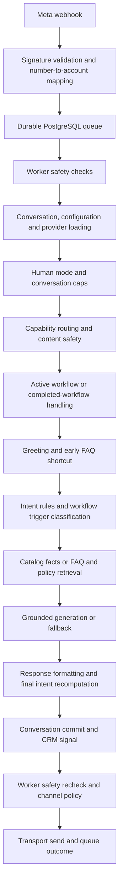

# Relayqo chatbot: pipeline and professional readiness audit

Reviewed 13 September 2026 against the current local working tree, including uncommitted changes. Production code was not changed.

**Verdict: a substantial engineering foundation, but not ready for an unattended professional rollout.** The largest gaps are inconsistent routing, loss of meaning in intent detection, handoff behavior, and state reliability. Improving the model alone will not fix these problems because several happen before a model is called or after its response is generated.

## Evidence and scope

- Production TypeScript check: passed (`npm run typecheck`). This was not a fresh Docker build or deployment.
- Selected database-independent unit files: **43 files, 490 tests; 486 passed, 4 failed**. The failures are in three UI contract files expecting old `/api/dev/...` strings. These failures do not, by themselves, establish broken runtime behavior.
- A separate audit harness exercised actual routing/engine/service/worker code with in-memory dependencies. It reproduced the examples below and saved outputs. Its successful execution means evidence was collected, not that the defects passed acceptance criteria.
- Inspected message ingress, queue/worker, conversation routing, ecommerce parsing, workflows and persistence, CRM/handoff, FAQ/RAG/PDF, providers, safety, authentication boundaries, ancillary services, telemetry, and deployment files. Depth varied; findings distinguish reproductions, source-confirmed behavior, and unverified deployment risks.
- Did not run the full database integration suite, live AI evaluations, Meta messaging, QR sessions, dependency vulnerability scanning, a database migration replay, or a production load/security test. No live customer messages or database changes were made. Secret values were not inspected.
- Existing audit documents were useful context, but their earlier conclusions were not treated as current proof. The current code includes newer queue fencing, delivery-receipt checks, fail-closed WhatsApp safety reads, and authentication fixes.

Evidence files: [probe results](../output/chatbot-audit/probes.json), [test results](../output/chatbot-audit/unit-results.json), [reproduction harness](../output/chatbot-audit/audit-probes.spec.ts). The output directory is local and ignored by Git.

## What the current pipeline does

The HTTP chat API enters the conversation engine without the WhatsApp worker. Image understanding exists as a separate capability, but the Meta extractor currently forwards text only. Consequently, protections and features visible in the engine do not automatically operate the same way through every channel.

## What is already good

- Tenant/account identity is carried through the core architecture. Knowledge search explicitly restricts tenant and account, with intentional access to tenant-global knowledge.
- Catalog price and inventory responses can come from stored product facts instead of model invention.
- Many frequent paths are deterministic, which can reduce cost and latency.
- Workflows include field validation, choice handling, cancellation, step limits and multilingual prompts.
- Conversation writes use a transaction; the queue has durable jobs, lease renewal and ownership checks, plus handling for uncertain outbound delivery.
- WhatsApp delivery is rechecked against pause/human state after generation. That is useful, although its interaction with handoff needs correction.
- The project has structured telemetry, output limits, knowledge quality filters, scoped credentials, encrypted channel credentials, and extensive regression tests.

These are useful foundations. The task is to make the components agree on the meaning and outcome of a turn.

## Findings to fix first

Priority meaning: **P1** should be fixed before relying on the affected behavior for clients; **P2** is the next hardening/quality work. Conditional findings apply only when the named service or route is used.

### 1. P1 — Early FAQ matching bypasses the stronger routing safeguards

**Reproduced through ConversationEngine with a shipping FAQ.**

| Customer message | Actual answer |
|---|---|
| `How much is shipping? And what is the return policy?` | `Shipping in Morocco costs 30 MAD.` |
| `How much is shipping to France?` | `Shipping in Morocco costs 30 MAD.` |

The first answer drops the return-policy request. The second uses evidence for the wrong destination. The early FAQ branch accepts a match before authoritative routing, whereas a later FAQ branch checks multipolicy requests, scope expansion and category/script compatibility. A match accepted early never reaches those later safeguards.

Evidence: `src/domain/conversation/ConversationEngine.ts:1198` and `:1656`; matching logic in `src/domain/faq/FaqMatcher.ts`.

**Upgrade:** resolve intent/entities/scope once before answer selection. Use one FAQ acceptance function across all paths. It must establish that the answer covers the complete request and its geographic/product scope; otherwise retrieve missing evidence or clarify.

**Acceptance:** a two-part question answers both parts or explicitly says which part lacks evidence; a foreign destination never receives a domestic rate as its applicable price.

### 2. P1 — Negation is ignored in purchase and human-handoff detection

**Reproduced with the actual parsers.**

| Message | Actual intent |
|---|---|
| `I do not want to buy this` | `BUY_INTENT`, confidence 0.95 |
| `لا أريد شراء هذا` | `BUY_INTENT`, confidence 0.95 |
| `Do not transfer me to a human agent` | `HANDOFF_REQUEST`, confidence 1.0 |

The patterns match positive phrases inside negative statements. For purchase, this can create inappropriate sales responses or lead signals. For handoff, the engine can set humanRequested and silence subsequent automation despite the customer asking it not to.

Evidence: `src/domain/ecommerce/EcommerceIntent.ts:930`, `src/domain/conversation/HandoffService.ts:6`, and the handoff action in `ConversationEngine.ts:700`.

**Upgrade:** represent affirmation, negation, uncertainty and quoted/hypothetical mentions separately from the topic. Require an affirmative action request for state changes. Add negative examples in English, French, Arabic and Darija. Ambiguous cases should ask one concise clarification.

### 3. P1 — Policy keywords match inside unrelated words

**Reproduced with TurnDecisionResolver.**

| Message | Actual route | Cause |
|---|---|---|
| `Do you sell skincare products?` | Knowledge / CARE | `care` inside `skincare` |
| `What is the discount code?` | Knowledge / PAYMENT | `cod` inside `code` |
| `I want to buy a spaceship toy` | Knowledge / SHIPPING | `ship` inside `spaceship` |

These are ordinary commercial questions. Some are routed away from catalog/purchase handling entirely. Policy vocabulary is repeated between the ecommerce parser and turn resolver, making inconsistencies harder to prevent.

Evidence: policy patterns in `src/domain/conversation/TurnDecision.ts:106` onward and `src/domain/ecommerce/EcommerceIntent.ts:709`.

**Upgrade:** centralize phrase definitions, use Unicode-aware token boundaries, and resolve overlapping candidates explicitly. Arabic clitics need language-aware normalization; adding ASCII `\b` everywhere is not sufficient. Include product names containing policy words in regression cases.

### 4. P1 — Handoff acknowledgment is generated, then blocked from delivery

**Reproduced using the actual WhatsAppWorker and ClientSafetyGuard with in-memory state.** Before processing, safety permits the turn. The engine marks humanRequested and creates the acknowledgment. The post-generation safety check sees that new flag and blocks the acknowledgment. The reproduction recorded **zero transport calls**.

A following customer message was also stopped before the engine ran. The durable inbound job still exists, but the message does not enter normal conversation history through this path. A human reviewing conversation history can therefore miss the details customers send after requesting help.

Evidence: `src/domain/channel/whatsapp/WhatsAppWorker.ts:68`, `:147`; `src/domain/channel/guard/ClientSafetyGuard.ts:267`; handoff commit in `ConversationEngine.ts:736`.

**Upgrade:** persist inbound messages independently of whether automation is allowed. Introduce a specific, idempotent handoff acknowledgment event permitted once, while keeping ordinary automated replies blocked. Give agents an inbox and an actual notification/assignment mechanism. Only claim someone was notified after a notification was successfully queued; the reviewed handoff path primarily updates database state.

### 5. P1 — Temporary guard restrictions can permanently discard a reply

**Source-confirmed.** Circuit-breaker-open, rate limiting, tenant pause and human takeover all enter the same worker denial branch. That branch returns `isRetryable:false`. Queue handling completes a non-retryable result rather than scheduling it for later.

Permanent denial and temporary unavailability have different meanings. A temporary provider circuit opening can cause subsequent inbound work to finish without a reply. For human takeover, suppressing automation is intentional, but discarding the conversation-history ingestion is not useful.

Evidence: `WhatsAppWorker.ts:77`, `ClientSafetyGuard.ts:192` and its rate-limit branch; `MessageQueue.ts:416`–`:434`.

**Upgrade:** return typed dispositions such as `ALLOW`, `DEFER_UNTIL`, `SUPPRESS_BOT_BUT_STORE`, and `REJECT`. Retry transient infrastructure/circuit conditions with a bounded deadline. Store intentional suppression explicitly instead of conflating it with delivery failure.

### 6. P1 — Conflict retry can overwrite newer conversation state

**Reproduced with the actual commit method and a mocked version conflict.** A write prepared for version 7 fails; the method reads version 8 and submits exactly the same old context under the new version. It does not recompute the turn from the new context.

This defeats the purpose of the optimistic lock: two simultaneous API requests, or overlapping channels sharing a conversation, can overwrite newer collected fields or workflow state. Queue serialization reduces exposure for its own partition but does not protect every engine entry point. Workflow-session creation also happens before the final conversation commit, so creation and state advancement should be reviewed together.

Evidence: `src/domain/conversation/ConversationService.ts:395`, `:477`; session creation in `ConversationEngine.ts:1308`.

**Upgrade:** serialize all turns by conversation, or retry the entire read/decide/commit operation after a conflict. Do not merely replace the expected version on a stale mutation. Include workflow-session creation and business side effects in the transaction/outbox design.

### 7. P1 when RAG is enabled — Production can use mock embeddings, and embedding calls lack a deadline

**Source-confirmed, not a claim about deployed credentials.** Production with a valid DeepSeek key can pass the provider checks while GOOGLE_API_KEY is absent. Bootstrap then creates MockEmbeddingProvider. Those vectors are test data, not semantic representations. Ingestion can persist them and retrieval can become meaningless.

Separately, GeminiEmbeddingProvider calls fetch without a timeout signal or bounded retry policy. The generation providers have timeouts, but this earlier retrieval dependency does not. A hanging request can hold the conversation/worker until the underlying network stack eventually fails it.

Evidence: `src/bootstrap.ts:79`–`:93`; `src/core/rag/EmbeddingProvider.ts:5`; `src/core/rag/GeminiEmbeddingProvider.ts:23`.

**Upgrade:** fail readiness or explicitly disable RAG when the required real embedding provider is unavailable. Store actual provider/model/dimension/version with indexed documents; do not mix mock and production vectors. Add an embedding deadline and bounded transient retries within a total turn deadline. Reindex any documents confirmed to have been ingested with the wrong provider.

### 8. P2 — Final intent recomputation corrupts telemetry and CRM inputs

**Reproduced through ConversationEngine.** With a booking workflow configured but no active workflow, `Hello` produced a greeting while telemetry and the CRM input labeled the turn `WORKFLOW / WORKFLOW_STEP`.

The final resolver receives `isWorkflow: Boolean(activeSession || hasWorkflowsConfigured)`. Merely having a workflow is treated as executing one. This can hide purchase signals from the decision-based CRM branch; a separate keyword fallback catches some purchase phrases, but does not make the metadata correct.

Evidence: `ConversationEngine.ts:2389`–`:2404`, `:2473`; `src/domain/crm/CRMService.ts:236`.

**Upgrade:** keep the original intent immutable. Record executed capability, response source and workflow status as separate fields. Pass the same intent into execution, CRM and telemetry. Emit distinct generated, committed, sent and delivered events; `response_completed` currently precedes the commit.

### 9. P2 — Cross-domain requests lose secondary intent

**Reproduced at the decision layer:** `I want to buy this and how much is shipping?` becomes SHIPPING only. There is support for multiple policy topics, but no comparable representation for purchase plus shipping, product price plus returns, or cancellation plus an address correction.

**Upgrade:** represent a primary intent plus secondary intents and outstanding questions. Answer a prerequisite question, retain the purchase request, and confirm the next action where needed. Do not automatically execute multiple business actions just because multiple topics were detected.

### 10. P2 — WhatsApp media support does not reach the image capability

**Reproduced at extraction:** a valid-shaped image message with a caption returns an empty extracted-message list. Audio, documents and interactive message types similarly lack handling in the reviewed text-only extractor.

Evidence: `src/domain/channel/whatsapp/WhatsAppWebhookExtractor.ts:43`. This is a feature gap, not proof that the separate image analyzer is defective.

**Upgrade:** map supported media and button/list replies into a typed channel-neutral message. Fetch media through authenticated provider APIs, enforce size/type rules, and give a clear unsupported-message response. Preserve message IDs, captions and attachments in history. Advertise only the channels/types actually wired end to end.

### 11. P1 if these services are network reachable — Ancillary services lack application authentication

**Source-confirmed; deployment reachability was not checked.** The image analysis endpoint accepts a caller-supplied tenant identity and can invoke the provider. Monitoring telemetry ingest and trace-query routes are registered without the admin authentication used elsewhere in that service.

Evidence: `apps/image-service/src/index.ts:50`; `apps/monitoring-service/src/server.ts:40`, `:60` and subsequent trace listing.

If exposed, this permits provider-cost abuse, fabricated telemetry, or unauthorized observation of trace metadata. The main application's authentication does not protect separately hosted services automatically.

**Upgrade:** service-to-service authentication and private network binding/ingress rules. Derive tenant scope from verified identity, authenticate both ingestion and reads, and limit requests globally as well as per tenant. Verify the actual deployed network boundaries before enabling those services externally.

### 12. P2 — Direct engine automation-state failures are treated as no restriction

**Reproduced:** ConversationService.getAutomationState returns null when the database read throws. The engine interprets a missing state as no automation restriction. The WhatsApp worker has additional fail-closed checks, but direct HTTP chat does not get those same checks.

Evidence: `src/domain/conversation/ConversationService.ts:282`; `ConversationEngine.ts:442`.

**Upgrade:** distinguish `no record` from `state unavailable`, and defer/reject automated processing on unavailable safety state. Apply the same safety contract through all channels.

## Additional pipeline upgrades

### Intent and conversation design

The current intent confidence numbers are assigned constants, not measured probabilities. A wrong negative purchase receives 0.95 and a wrong handoff 1.0. Do not present these as calibrated certainty.

Introduce one structured decision containing primary intent, secondary intents, entities, polarity, unresolved references, workflow context, reason and an explicit clarify/execute choice. Keep deterministic routes for unmistakable cases; use constrained semantic classification only for ambiguous cases. Classification should propose an action, while ordinary application code checks authorization, required fields and business rules.

Split the 2,786-line ConversationEngine incrementally into orchestration, intent resolution, workflow handling, knowledge answering, catalog answering and persistence. Avoid a wholesale rewrite while behavior is unstable. Remove duplicate branches only after whole-engine acceptance tests cover them.

### Retrieval and documents

The scoped repository queries and failed-ingestion cleanup are strengths. The remaining quality work should include:

- Version source documents and invalidate conversation-cached policy evidence when source knowledge changes. The reviewed evidence-reuse checks assess content sufficiency without checking a current source revision or expiry.
- Store page/section/source references with evidence and make them available in operator diagnostics. A similarity score is not proof that an answer is supported.
- Evaluate retrieval against real embeddings using language-specific queries, conflicting policies, absent answers and account-global overrides. Mock vectors cannot establish semantic quality.
- Revisit PDF chunk sizing. The chunking method accepts chunkOverlap but does not use it; a very long sentence can also exceed the nominal chunk size. Add actual overlap where needed and a safe hard split. Validate scanned/table-heavy documents explicitly before treating them as supported.
- Consider hybrid lexical/vector retrieval and reranking only after a measured baseline shows the benefit. Do not add complexity without evaluating recall and answer correctness.

### Generation and safety

Keyword injection filters, internal-content filtering and response formatting help, but do not prove that a generated answer is grounded or resistant to indirect prompt injection. Treat retrieved documents, image/OCR text and customer input as untrusted data; maintain narrow tool permissions and validate outputs/actions independently of the prompt. This follows the defense-in-depth approach in [OWASP's LLM application guidance](https://owasp.org/www-project-top-10-for-large-language-model-applications/) and its [excessive-agency guidance](https://genai.owasp.org/llmrisk/llm062025-excessive-agency/).

Add tests for document-borne instructions, multilingual paraphrases, false refusals on legitimate complaints, absent evidence and contradictory evidence. No live model attack or factuality evaluation was performed here, so this report does not claim a measured injection success rate or hallucination rate.

### Business operations and observability

- Model an inbound turn and its outbound event explicitly. Pair replies with turn IDs instead of finding the first assistant message after a timestamp; current idempotent response lookup uses chronological association.
- Give operators clear handling for unknown delivery, retries, handoff ownership and resuming automation.
- Define what counts as a lead, an order and a completed booking. Do not show a transaction as completed until the authoritative business system confirms it.
- Track answer correctness, clarification/fallback rates, handoff acknowledgment and assignment, field-correction success, full-turn latency, provider cost, failed commits and delivery outcomes. Separate these by language and tenant/account.
- Review raw-text logging. Some engine log statements interpolate customer messages, while worker logs include customer WhatsApp IDs. Define redaction, retention and operator access rather than relying only on telemetry metadata filtering.
- Put a reproducible verification pipeline in place. No checked-in CI workflow appeared in the repository inventory. Keep offline tests separate from explicit live tests: the smoke test currently sets USE_REAL_AI=true internally, so a broad test invocation can unexpectedly opt into provider calls when credentials exist.

## Recommended upgrade order

This is sequencing guidance, not a delivery-time guarantee.

| Stage | Work | Required proof |
|---|---|---|
| 1. Correctness blockers | Unified FAQ acceptance; negation/token boundaries; handoff acknowledgment plus inbound persistence; transient guard dispositions; correct conflict retry; production embedding readiness | All reproduced cases become desired-behavior tests; no real customer side effects during verification |
| 2. One decision per turn | Preserve intent through execution/CRM/telemetry; secondary intents; clarify ambiguous targets; extract duplicate routing branches | Whole-engine conversations, not only parser tests, produce consistent decisions and answers |
| 3. Evidence and operations | Knowledge revisions; total turn deadlines; private/authenticated ancillary services; operator handoff and unknown-delivery procedures | Failure injection, knowledge-update checks and authorization tests |
| 4. Controlled client pilot | Real-model multilingual evaluation; isolated PostgreSQL concurrency tests; staging channel round trips; observability dashboards | Measured pilot outcomes and a reversible rollout procedure |

## Suggested acceptance suite

Start with 100–200 independently written customer messages plus multi-turn scenarios, balanced across English, French, Arabic script and Darija/Arabizi. Keep a held-out set that is not used to write regex rules. Include misspellings, mixed languages, corrections, negation, two requests at once, new topics after product selection, and unavailable answers.

Minimum scenario groups:

1. Search → numbered selection → size/color change → price → purchase intent.
2. Purchase plus shipping/return questions; the pending purchase must remain represented.
3. Workflow → interruption → answer → resume → correct an earlier field → confirm once.
4. Handoff → acknowledgment → follow-up messages visible to the agent → agent resolution → explicit bot resume.
5. Two simultaneous turns, duplicate inbound IDs, lease expiry, process interruption, uncertain provider delivery and provider outage.
6. Wrong tenant/account credentials and ancillary-service calls without identity.
7. Deleted/updated knowledge, unsupported destinations, contradictory policies and no relevant document.
8. Images, attachments and interactive replies through the real channel adapter.

Set numerical release targets after measuring a baseline. Some acceptance criteria should be categorical: no cross-tenant access, no purchase/handoff action from an explicitly negative request, no silent loss of incoming human-mode messages, and no claimed successful order without business-system confirmation. Passing a finite test suite supports confidence; it does not prove these can never fail.

**Release decision:** retain the architecture, correct the reproduced failures, and evaluate whole conversations before adding more features or changing models. The existing backend is worth improving; its current happy-path test success is insufficient evidence of professional customer experience.
