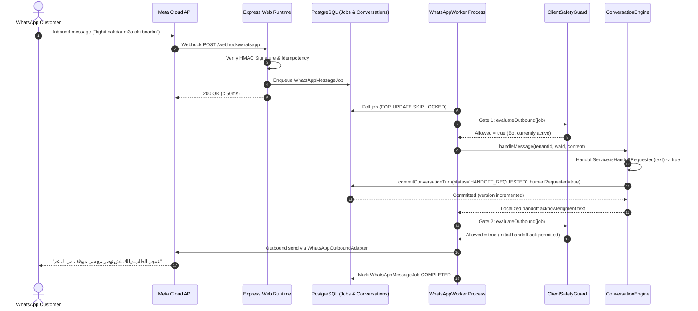
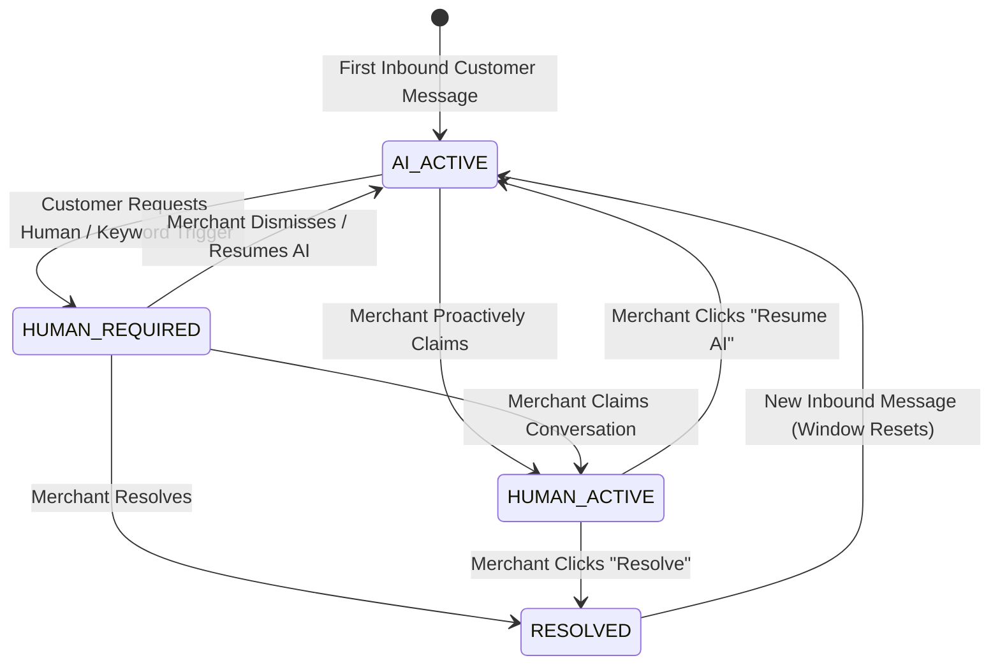
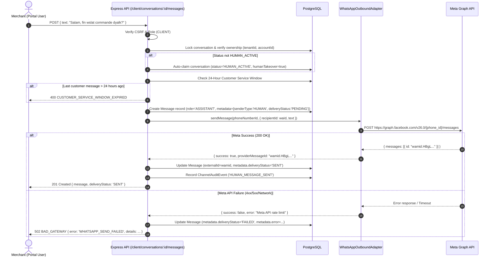
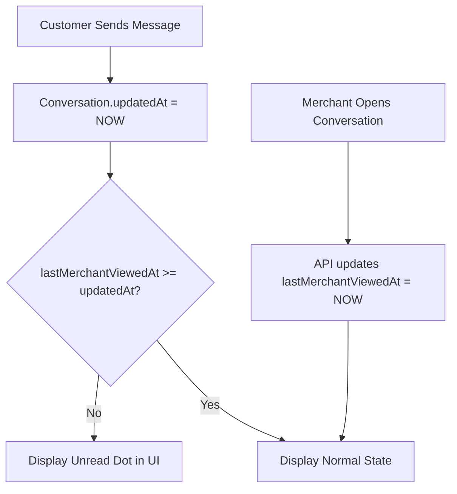

# Relayqo — Merchant Inbox & Human Handoff Architecture (Phase 3A)

## Executive Summary & Core Architectural Answers

This document defines the production architecture for the Relayqo Merchant Conversation Inbox and Human Takeover capability. The system extends Relayqo's existing multi-tenant WhatsApp AI infrastructure, strictly adhering to the fail-closed security boundary, runtime web/worker separation, and PostgreSQL durable storage model established in Phases 1 and 2.

### Critical Constraint Questions Answered

1. **Do we need a new Conversation model?**  
   **NO.** The existing `Conversation` Prisma model already provides complete tenant/account scoping (`tenantId`, `accountId`), contact mapping (`customerId`), state tracking (`status`, `humanRequested`, `humanRequestedAt`), versioning (`version`), and extensible metadata (`contextData`). Introducing a parallel conversation table would cause data divergence and race conditions with `ConversationEngine`.

2. **Do we need a new Message model?**  
   **NO.** The existing `Message` Prisma model already captures `tenantId`, `conversationId`, `role`, `content`, `externalId` (Meta `wamid`), `metadata` (JSON), and `createdAt`. Human agent replies are naturally represented with `role = 'ASSISTANT'` or `'AGENT'` with rich metadata (`{ senderType: 'HUMAN', authorId, authorName, deliveryStatus }`).

3. **Do we need a new Handoff model?**  
   **NO.** The schema already contains a dedicated `ConversationAutomationState` table (`conversationId` unique, `botEnabled`, `humanTakeover`, `pausedUntil`, `pauseReason`, `updatedBy`) paired with `Conversation.humanRequested` and `Conversation.status`.

4. **Do we currently support multiple merchant agents?**  
   **NO.** The current identity model defines two roles: `CLIENT` and `ADMIN`. A merchant user is a `PortalUser` associated with one or more businesses via `PortalMembership`. There are no agent, supervisor, or tier sub-roles in the schema. Therefore, **V1 is explicitly scoped to Account-Level Merchant Takeover** (any authorized client user of that account can view, claim, reply, and resolve). Multi-agent assignment, private routing queues, and agent workload distribution are deferred to V2.

5. **What is the authoritative AI-vs-human ownership state?**  
   The system implements a single, unambiguous server-side ownership rule:
   - **`AI_ACTIVE`**: `Conversation.status = 'ACTIVE'` AND `humanRequested = false` AND (`ConversationAutomationState.botEnabled = true` AND `humanTakeover = false`).
   - **`HUMAN_REQUIRED`**: `Conversation.status = 'HANDOFF_REQUESTED'` OR `Conversation.humanRequested = true` (with `humanTakeover = false`).
   - **`HUMAN_ACTIVE`**: `Conversation.status = 'HUMAN_ACTIVE'` OR `ConversationAutomationState.humanTakeover = true`.
   - **`RESOLVED`**: `Conversation.status = 'RESOLVED'`.
   
   **Golden Rule**: The AI is permitted to generate or send replies **ONLY IF** the conversation state evaluates strictly to `AI_ACTIVE`.

6. **Where exactly should AI suppression be enforced?**  
   Enforced via **two defense-in-depth gates** in the queue processing pipeline:
   - **Gate 1 (Worker Pre-LLM Entry)**: In `WhatsAppWorker.ts` (lines 80–94), before calling `ConversationEngine.handleMessage()`. If `ClientSafetyGuard.evaluateOutbound()` detects `HUMAN_TAKEOVER` or `HANDOFF_REQUESTED` (not initial ack), it invokes `recordInboundMessage()` to store the customer's text and immediately terminates the job without calling the LLM.
   - **Gate 2 (Worker Post-LLM / Pre-Outbound Send)**: In `WhatsAppWorker.ts` (lines 180–209), immediately before calling `channelRouter.routeOutbound()`. Re-evaluates `ClientSafetyGuard.evaluateOutbound()`. If a merchant claimed the conversation while the LLM was generating (Race A), the generated text is discarded and outbound transmission is blocked.

7. **How should human replies be made durable?**  
   Merchant replies are received via `POST /api/client/conversations/:id/messages`. The web runtime validates ownership, inserts a `Message` record with `metadata.deliveryStatus = 'PENDING'`, and calls `WhatsAppOutboundAdapter.sendMessage()`. Upon Meta Cloud API response, the record is updated with Meta's `providerMessageId` and `deliveryStatus = 'SENT'`. If Meta rejects the message (e.g. 24-hour window expired or network error), the record is updated to `deliveryStatus = 'FAILED'` and an HTTP error is returned to the UI with actionable feedback.

8. **What is the simplest reliable V1 real-time strategy?**  
   **Short Polling (3–5 seconds)** while a conversation is actively open, and 10–15 seconds for the inbox list. This requires zero stateful WebSocket or SSE infrastructure, operates seamlessly across horizontally scaled Express instances without sticky sessions or Redis Pub/Sub, survives network hiccups automatically, and works behind any CDN/reverse proxy.

9. **What schema migration is actually required?**  
   **Zero breaking migrations.** All core inbox functionality can be achieved using existing tables. To optimize performance at production scale, only two non-breaking composite database indexes are recommended:
   - `Conversation(tenantId, accountId, updatedAt DESC)`
   - `Message(tenantId, conversationId, createdAt ASC)`
   Unread tracking can be stored in `Conversation.contextData.lastMerchantViewedAt` without any schema modification, or via a single optional column `lastMerchantViewedAt DateTime?`.

---

## 1. Existing Components to Reuse

| Component | File Path | Existing Capabilities Reused |
|---|---|---|
| **Data Models** | `prisma/schema.prisma` | `Conversation`, `Message`, `Customer`, `ConversationAutomationState`, `WhatsAppBusinessNumber`, `ChannelConnection`, `PortalUser`, `PortalMembership`, `WhatsAppMessageJob`, `ChannelAuditEvent`. |
| **Outbound WhatsApp Adapter** | `src/domain/channel/whatsapp/WhatsAppOutboundAdapter.ts` | Meta Graph API client, credential resolution from `ChannelConnection` with `SecretBox` AES-256 decryption, exponential backoff retries, error categorization. |
| **Safety Guard** | `src/domain/channel/guard/ClientSafetyGuard.ts` | `evaluateOutbound()` checking bot status, `setHumanTakeover()` atomic toggles, rate limiting, audit recording. |
| **Conversation Service** | `src/domain/conversation/ConversationService.ts` | `getOrCreateConversation()`, `getLatestConversation()`, `persistMessage()`, `commitConversationTurn()`, optimistic concurrency control via `version`. |
| **Handoff Service** | `src/domain/conversation/HandoffService.ts` | Multilingual handoff trigger detection (EN, FR, AR, Darija) and localized acknowledgments. |
| **Inbound Worker** | `src/domain/channel/whatsapp/WhatsAppWorker.ts` | Pre-LLM safety suppression (Gate 1), Post-LLM safety suppression (Gate 2), inbound message persistence during human takeover (`recordInboundMessage`). |
| **Portal Identity & Auth** | `src/portal/PortalAuth.ts` | Cookie-backed sessions, CSRF token verification, tenant/account extraction from `PortalMembership`. |
| **Portal Store & DB** | `src/portal/PortalStore.ts` | Safe parameterized queries, transaction helpers, audit logging (`auditHistory`). |
| **Portal UI Theme & Shell** | `src/portal/ui/portal.js`, `portal.css` | UI layout system (`shell`, `nav`, `card`, `badge`, `btn`, toast notifications). |

---

## 2. Current Conversation & Handoff Lifecycle



### What Happens on Subsequent Customer Messages?
When the customer replies again while `status = 'HANDOFF_REQUESTED'`:
1. The message is enqueued into `WhatsAppMessageJob`.
2. `WhatsAppWorker` runs **Gate 1**: `safetyGuard.evaluateOutbound()`.
3. `ClientSafetyGuard` observes `conv.humanRequested === true` and `status === 'HANDOFF_REQUESTED'`. Since this is *not* the initial acknowledgment, it returns `{ allowed: false, code: 'HUMAN_TAKEOVER' }`.
4. `WhatsAppWorker` calls `conversationEngine.recordInboundMessage()`, saving the customer's message into `Message` table as `USER` role.
5. The worker terminates the job immediately. **Zero LLM tokens are consumed, and no automated bot reply is sent.**

---

## 3. Gaps in Current System

1. **Missing Merchant Surface**: In `src/portal/PortalRouter.ts`, conversation triage routes (`/admin/handoffs`, `/admin/accounts/:id/conversations/:conversationId/triage`) exist solely under the `/admin` prefix. Merchant portal users (`role: 'CLIENT'`) have zero conversation endpoints.
2. **No Human Outbound API**: There is currently no endpoint allowing a merchant or admin to type a custom response and dispatch it through WhatsApp to a customer.
3. **Dual State Drift Risk**:
   - `PortalRouter` admin triage updates `Conversation.status = 'HUMAN_ACTIVE'` and `contextData._portalHandoff`, but leaves `ConversationAutomationState` unchanged.
   - `ClientSafetyGuard.setHumanTakeover` updates `ConversationAutomationState` (`humanTakeover = true`), but does not update `Conversation.status = 'HUMAN_ACTIVE'`.
   - These two paths must be unified into a single transactional state transition.
4. **No Read/Unread Tracking**: Neither `Conversation` nor `Message` records whether the merchant has read the latest customer messages.
5. **No Client Inbox UI**: `src/portal/ui/portal.js` contains pages for `/app/business`, `/app/whatsapp`, and `/app/plans`, but no `/app/inbox` route or interface.
6. **Missing Indexes for Scale**: Listing conversations by `updatedAt` for an account requires scanning without an index on `[tenantId, accountId, updatedAt]`.

---

## 4. Proposed V1 Scope

- **Inbox Navigation**: Add `/app/inbox` to merchant portal workspace.
- **Conversation List**:
  - Filter tabs: `All`, `Needs Human` (`HANDOFF_REQUESTED`), `In Progress` (`HUMAN_ACTIVE`), `Resolved`.
  - Display: Customer phone number, relative timestamp, status badge, unread dot, snippet of last message.
- **Conversation Transcript**:
  - Full chronological message history with pagination.
  - Message differentiation: Customer message (`USER`), Chatbot response (`ASSISTANT` with bot icon), Human agent reply (`ASSISTANT` with agent badge and sender name).
- **Takeover & Triage Actions**:
  - **Claim**: Takes ownership, transitions conversation to `HUMAN_ACTIVE`, stops all AI replies.
  - **Resume AI (Release)**: Restores bot automation, transitions conversation to `ACTIVE`.
  - **Resolve**: Marks conversation as `RESOLVED`.
- **Human Reply Composer**:
  - Textarea input with character counter.
  - Delivery feedback: "Sending...", "Sent", or "Send Failed" with retry.
  - 24-Hour WhatsApp Service Window indicator (warns if Meta window has expired).
- **Polling Synchronization**: Periodic refresh (3–5s) while viewing a conversation.
- **Strict Multi-Tenant Isolation**: Verification that queries are locked to the authenticated user's account and tenant.

---

## 5. Explicitly Deferred V2 Scope

The following features are strictly deferred to maintain V1 stability:
- Multi-agent user seats, roles (Supervisor vs Agent), and team hierarchies.
- Manual agent-to-agent assignment and re-assignment.
- Per-agent workload tracking and routing algorithms.
- Internal private team notes (non-customer visible messages).
- Rich media uploading (sending PDFs, images, or audio notes from merchant portal).
- Outbound WhatsApp Template messaging for initiating contact outside the 24-hour window.
- WebSocket / Server-Sent Events real-time push infrastructure.
- AI Copilot / suggested response generation for human agents.

---

## 6. Data-Model Changes & Schema Strategy

### Minimal Schema Plan (Zero Breaking Migrations)
The existing database schema is completely sufficient for V1.

```
Existing Tables Reused:
├── Conversation               (Tracks session, customer, account, status, version)
├── Message                    (Stores user, bot, and human messages)
├── Customer                   (Stores customer phone/waId)
├── ConversationAutomationState(Tracks botEnabled, humanTakeover, updatedBy)
├── ChannelConnection          (Decrypted credentials for Meta Cloud API)
└── WhatsAppBusinessNumber     (Phone number ID and account binding)
```

### Read/Unread Tracking Strategy
To avoid any schema migrations in V1:
- Store `lastMerchantViewedAt` inside `Conversation.contextData` as an ISO string:
  ```json
  {
    "lastMerchantViewedAt": "2026-09-20T22:30:00.000Z",
    "_portalHandoff": {
      "claimedBy": "user-uuid",
      "claimedAt": "2026-09-20T22:15:00.000Z"
    }
  }
  ```
- An unread conversation is computed as:
  `c.updatedAt > (c.contextData->>'lastMerchantViewedAt')::timestamptz` (or true if field is null and last message is `USER`).
- *Optional V1.1 migration*: Add column `lastMerchantViewedAt DateTime?` to `Conversation` table.

### Human Message Representation in `Message` Table
```json
{
  "id": "uuid",
  "tenantId": "tenant-uuid",
  "conversationId": "conv-uuid",
  "role": "ASSISTANT",
  "content": "Bonjour, je suis Ilyes. Comment puis-je vous aider ?",
  "externalId": "wamid.HBgLM...",
  "metadata": {
    "senderType": "HUMAN",
    "authorId": "user-uuid",
    "authorName": "Ilyes Saber",
    "deliveryStatus": "SENT",
    "sentAt": 1758407400000
  },
  "createdAt": "2026-09-20T22:30:00.000Z"
}
```

---

## 7. Authoritative State Machine



### State Definitions & Server-Side Evaluation

| Canonical State | `Conversation.status` | `Conversation.humanRequested` | `AutomationState.humanTakeover` | `AutomationState.botEnabled` | May AI Reply? |
|---|---|---|---|---|---|
| **`AI_ACTIVE`** | `'ACTIVE'` | `false` | `false` | `true` | **YES** |
| **`HUMAN_REQUIRED`** | `'HANDOFF_REQUESTED'` | `true` | `false` | `true` or `false` | **NO** |
| **`HUMAN_ACTIVE`** | `'HUMAN_ACTIVE'` | `true` | `true` | `false` | **NO** |
| **`RESOLVED`** | `'RESOLVED'` | `false` | `false` | `true` | **NO** |

---

## 8. V1 Inbox API Design

All endpoints reside under the authenticated `/api/client` router in `src/portal/PortalRouter.ts`.

### 1. List Conversations
- **Method & Route**: `GET /api/client/conversations`
- **Auth**: Cookie session (`PortalUser.role === 'CLIENT'`).
- **Account Scope**: Strict filter on `tenantId = req.portal.tenantId` and `accountId = req.portal.accountId`.
- **Query Params**:
  - `status`: `'all'` | `'needs_human'` | `'in_progress'` | `'resolved'`
  - `search`: String (optional search on customer phone number / externalId)
  - `limit`: Integer (default: 30, max: 100)
  - `offset`: Integer (default: 0)
- **Response (200)**:
  ```json
  {
    "conversations": [
      {
        "id": "conv-uuid",
        "customerPhone": "+212600000000",
        "customerLabel": "Customer ••••0000",
        "status": "HUMAN_ACTIVE",
        "humanRequested": true,
        "isUnread": true,
        "lastMessage": {
          "role": "USER",
          "content": "Salam, bghit nswl 3la le prix dial produit X",
          "createdAt": "2026-09-20T22:25:00.000Z"
        },
        "claimedBy": "Ilyes Saber",
        "updatedAt": "2026-09-20T22:25:00.000Z"
      }
    ],
    "counts": {
      "all": 42,
      "needs_human": 3,
      "in_progress": 2,
      "resolved": 37
    }
  }
  ```

### 2. Get Conversation & Transcript
- **Method & Route**: `GET /api/client/conversations/:id`
- **Auth**: Cookie session. Scoped to `accountId` and `tenantId`.
- **Side Effect**: Updates `contextData.lastMerchantViewedAt = NOW()` to mark conversation as read.
- **Response (200)**:
  ```json
  {
    "conversation": {
      "id": "conv-uuid",
      "customerPhone": "+212600000000",
      "status": "HUMAN_ACTIVE",
      "humanRequested": true,
      "claimedBy": "Ilyes Saber",
      "isWithin24hWindow": true,
      "lastCustomerMessageAt": "2026-09-20T22:25:00.000Z"
    },
    "messages": [
      {
        "id": "msg-1",
        "role": "USER",
        "content": "Salam, bghit nswl 3la commande dyali",
        "createdAt": "2026-09-20T22:20:00.000Z"
      },
      {
        "id": "msg-2",
        "role": "ASSISTANT",
        "content": "تسجل الطلب ديالك باش تهضر مع شي موظف من الدعم.",
        "senderType": "BOT",
        "createdAt": "2026-09-20T22:20:02.000Z"
      },
      {
        "id": "msg-3",
        "role": "ASSISTANT",
        "content": "Marhba bik! 3tini raqm dial commande 3afak.",
        "senderType": "HUMAN",
        "authorName": "Ilyes Saber",
        "deliveryStatus": "SENT",
        "createdAt": "2026-09-20T22:22:00.000Z"
      }
    ]
  }
  ```

### 3. Claim Conversation (Takeover)
- **Method & Route**: `POST /api/client/conversations/:id/claim`
- **Auth**: Cookie session + CSRF token.
- **Database Transaction**:
  1. `SELECT ... FROM "Conversation" WHERE id = :id AND "accountId" = :accountId FOR UPDATE`.
  2. Upsert `ConversationAutomationState`: `{ humanTakeover: true, botEnabled: false, updatedBy: userId }`.
  3. Update `Conversation`: `{ status: 'HUMAN_ACTIVE', humanRequested: true, contextData: { ...contextData, _portalHandoff: { ownerId: userId, claimedAt: NOW() } } }`.
  4. Record `ChannelAuditEvent`: action `'HUMAN_TAKEOVER_ACTIVATED'`.
- **Response (200)**: `{ "success": true, "status": "HUMAN_ACTIVE" }`

### 4. Release Conversation (Resume AI)
- **Method & Route**: `POST /api/client/conversations/:id/release`
- **Auth**: Cookie session + CSRF token.
- **Database Transaction**:
  1. `SELECT ... FOR UPDATE`.
  2. Upsert `ConversationAutomationState`: `{ humanTakeover: false, botEnabled: true, updatedBy: userId }`.
  3. Update `Conversation`: `{ status: 'ACTIVE', humanRequested: false, humanRequestedAt: null }`.
  4. Record `ChannelAuditEvent`: action `'BOT_AUTOMATION_RESUMED'`.
- **Response (200)**: `{ "success": true, "status": "ACTIVE" }`

### 5. Resolve Conversation
- **Method & Route**: `POST /api/client/conversations/:id/resolve`
- **Auth**: Cookie session + CSRF token.
- **Database Transaction**:
  1. `SELECT ... FOR UPDATE`.
  2. Upsert `ConversationAutomationState`: `{ humanTakeover: false, botEnabled: true, updatedBy: userId }`.
  3. Update `Conversation`: `{ status: 'RESOLVED', humanRequested: false, humanRequestedAt: null }`.
  4. Record `ChannelAuditEvent`: action `'HANDOFF_RESOLVED'`.
- **Response (200)**: `{ "success": true, "status": "RESOLVED" }`

### 6. Send Human Message
- **Method & Route**: `POST /api/client/conversations/:id/messages`
- **Auth**: Cookie session + CSRF token.
- **Body**: `{ "text": "Bonjour, votre commande est en cours de livraison." }`
- **Execution Flow**: Detailed in Section 10 below.
- **Response (201)**: `{ "success": true, "message": { "id": "msg-uuid", "content": "...", "deliveryStatus": "SENT" } }`

---

## 9. Authorization & Tenant Isolation Model

Every query must rigorously prevent cross-tenant and cross-account access.

```
Incoming Request
       │
       ▼
PortalAuth.principal(req)
       │
       ├── Reads session token from httpOnly cookie 'relayqo_portal'
       ├── Validates session expiry and user state in PortalSession
       ├── Loads PortalMembership records for user.id
       ├── Resolves active accountId from 'x-account-id' header (matching membership)
       └── Rejects immediately with 403 ACCOUNT_ACCESS_DENIED if not a member
       │
       ▼
req.portal = { user, accountId, tenantId } (Authoritative Server-Side Context)
```

### Enforcement Rules
1. **Never trust client-supplied tenant/account identifiers in URLs or payloads**: The route handler strictly ignores any user-submitted `tenantId` parameter and forces `tenantId = req.portal.tenantId` and `accountId = req.portal.accountId`.
2. **Negative Isolation Proof**:
   - *Merchant A attempts `GET /api/client/conversations/conv-B`*: Query executes `WHERE id = 'conv-B' AND accountId = req.portal.accountId AND tenantId = req.portal.tenantId`. Query returns 0 rows; endpoint throws `404 CONVERSATION_NOT_FOUND`.
   - *Merchant A attempts `POST /api/client/conversations/conv-B/messages`*: SQL update fails with `404 CONVERSATION_NOT_FOUND`; no Meta message is sent.
   - *Platform `ADMIN` vs Merchant `CLIENT`*: Route middleware strictly verifies `role === 'CLIENT'`. Platform admins use `/admin/*` and cannot accidentally pollute client metrics.

---

## 10. Human Outbound Message Lifecycle



### Why Synchronous Outbound Send from the Web Runtime is Safe for Human Replies:
- Unlike inbound webhooks which must respond to Meta in < 50ms (requiring asynchronous queueing via `WhatsAppMessageJob`), a merchant clicking "Send" in a browser UI *expects* an immediate synchronous round-trip (< 1000ms) confirming delivery or alerting them to failure.
- `WhatsAppOutboundAdapter` is already non-blocking and handles connection lookup, token resolution, and retries.
- If Meta fails, the UI receives an immediate 502 response and displays an error badge next to the message, allowing the merchant to retry immediately.

---

## 11. AI Suppression Strategy (Defense in Depth)

To guarantee that the AI bot **never** sends an automated reply while a human owns the conversation, Relayqo uses a two-gate defense:

```
Inbound Customer Message
         │
         ▼
[ WhatsAppMessageJob ]
         │
         ▼
┌────────────────────────────────────────┐
│  GATE 1: Worker Inbound Entry Check    │
│  (WhatsAppWorker.ts lines 80-94)       │
└────────────────────────────────────────┘
         │
         ├──► Is humanTakeover == true OR humanRequested == true?
         │    │
         │    ├── YES: Save message via recordInboundMessage().
         │    │        Log suppression. Terminate job.
         │    │        [0 LLM TOKENS CONSUMED, 0 OUTBOUND SENT]
         │    │
         │    └── NO: Proceed to ConversationEngine.handleMessage()
         ▼
┌────────────────────────────────────────┐
│  LLM / Workflow Generation             │
│  (Takes 500ms - 3000ms)                │
└────────────────────────────────────────┘
         │
         ▼
┌────────────────────────────────────────┐
│  GATE 2: Post-LLM / Pre-Send Check     │
│  (WhatsAppWorker.ts lines 180-209)     │
└────────────────────────────────────────┘
         │
         ├──► Did merchant claim conversation DURING generation?
         │    │
         │    ├── YES: Discard LLM response.
         │    │        Log suppression. Terminate job.
         │    │        [NO OUTBOUND SENT TO META]
         │    │
         │    └── NO: Call channelRouter.routeOutbound()
         ▼
   Meta Cloud API
```

---

## 12. Race-Condition Analysis & Mitigation Matrix

| Race Condition | Scenario Description | Concrete Mitigation Mechanism |
|---|---|---|
| **Race A: Takeover during LLM generation** | Worker begins generating LLM reply. Merchant clicks "Claim". LLM finishes generating 1.5s later. | **Gate 2 in `WhatsAppWorker.ts`**: Immediately before `channelRouter.routeOutbound()`, `ClientSafetyGuard.evaluateOutbound()` is re-executed. It detects `humanTakeover = true` (written by merchant's claim transaction), discards the LLM text, and blocks the outbound send. |
| **Race B: Inbound customer message during human reply** | Merchant submits a reply at the exact millisecond customer sends another WhatsApp message. | **Queue Partitioning + Gate 1**: Inbound customer message is assigned partition key `job.waId`. Worker processes jobs in FIFO order. When it executes Gate 1, `humanTakeover === true`, so customer message is appended to the transcript via `recordInboundMessage()`. No AI turn is triggered. |
| **Race C: Simultaneous claims by two browser tabs** | Two merchant sessions click "Claim" on the same conversation simultaneously. | **Row-Level Lock (`FOR UPDATE`)**: The claim endpoint runs in a PostgreSQL transaction: `SELECT ... FROM "Conversation" WHERE id = :id FOR UPDATE`. The first transaction acquires the lock and claims the conversation. The second transaction waits, then reads the updated state and completes idempotently. |
| **Race D: Resolve during incoming message** | Merchant clicks "Resolve" while an incoming customer message is in flight in the queue. | **Atomic Status Transition**: If the message hits Gate 1 after resolve, it finds `status = 'RESOLVED'` and `humanTakeover = false`. If bot is enabled, it transitions the conversation cleanly back to `ACTIVE` and answers the customer. If it hits before resolve, the message is recorded, and the subsequent resolve closes the ticket. |
| **Race E: Meta delivery failure on human reply** | Merchant sends reply, but Meta returns 500 or recipient number is invalid. | **Transactional Message State**: Message is persisted with `deliveryStatus = 'PENDING'`. Upon adapter error, it is updated to `deliveryStatus = 'FAILED'` with error details. API returns HTTP 502 with error details, allowing the UI to render a red "Failed to send" banner and retry button. |

---

## 13. Real-Time / Synchronization Strategy

### Architecture Evaluation

| Criterion | A. Short Polling (Recommended) | B. Server-Sent Events (SSE) | C. WebSockets |
|---|---|---|---|
| **Architectural Fit** | Native fit with existing Express web runtime | Requires persistent open connections per client | Requires stateful duplex connections |
| **Multi-Instance Scaling** | Stateless; works across any number of web nodes without coordination | Requires Redis Pub/Sub to broadcast across nodes | Requires Redis Pub/Sub + sticky sessions |
| **Failure Recovery** | Trivial; automatic retry on next poll interval | Requires manual client reconnect & backoff logic | Requires complex handshake & heartbeat management |
| **Operational Overhead** | Near zero | Moderate | High |
| **Latency for Merchant** | 3 seconds (completely acceptable for WhatsApp) | < 500ms | < 200ms |

### Recommendation for V1: Short Polling
- When the merchant is viewing the **Conversation List**: Poll `GET /api/client/conversations` every **10 seconds**.
- When the merchant has an **Active Conversation Open**: Poll `GET /api/client/conversations/:id` every **3 seconds**.
- **Smart Throttling**: Use `document.visibilityState` to halt polling completely when the browser tab is minimized or inactive.
- **Cache Optimization**: Use an `updatedAt` filter (`?since=...`) so polling queries return empty `304 Not Modified` or minimal payloads when no new messages exist.

---

## 14. Read / Unread Status Design

### Computation Model
Rather than maintaining an integer counter (which easily suffers from race conditions and drift), unread status is determined dynamically from timestamps:

$$\text{isUnread} = (\text{lastCustomerMessageAt} > \text{lastMerchantViewedAt})$$



### Storage Location
- In V1, `lastMerchantViewedAt` is stored in `Conversation.contextData`:
  ```sql
  UPDATE "Conversation"
  SET "contextData" = jsonb_set("contextData", '{lastMerchantViewedAt}', to_jsonb(NOW()::text)::jsonb),
      "updatedAt" = "updatedAt"
  WHERE id = $1;
  ```
- *Note*: Because this update is a merchant read operation, we do **not** increment `version` or touch `messageCount`.

---

## 15. Portal UI Architecture

The merchant inbox is designed as an extension of Relayqo’s existing single-page portal application in `src/portal/ui/portal.js` and `portal.css`.

### Layout Blueprint (Desktop Two-Column Workspace)

```
┌────────────────────────────────────────────────────────────────────────────────────────┐
│  Relayqo Workspace › Inbox                                        [● Live Connection]  │
├───────────────────────────────┬────────────────────────────────────────────────────────┤
│  Filters:                     │  Customer ••••1234 (+212 600-001234)                   │
│  [All] [Needs Human] [Active] │  Status: [ Needs Reply ]      [ Claim Conversation ]   │
├───────────────────────────────┼────────────────────────────────────────────────────────┤
│  ● Customer ••••1234   10:42  │                                                        │
│    "Salam, bghit nswl..."     │  [10:40] Customer:                                     │
│    [ Needs Reply ]            │  Salam, bghit nswl 3la le prix dial produit X          │
│                               │                                                        │
│    Customer ••••8899   09:15  │  [10:41] Assistant (Bot):                              │
│    "Merci bzaf!"              │  Marhba! Le prix dial produit X houwa 250 DH.          │
│    [ Bot Active ]             │                                                        │
│                               │  [10:42] Customer:                                     │
│    Customer ••••4567   Yest.  │  Wach momkin l-livraison l Casa lyouma?                │
│    "Order confirmed"          │                                                        │
│    [ Resolved ]               │                                                        │
│                               ├────────────────────────────────────────────────────────┤
│                               │  Type your reply as human agent...                     │
│                               │  ┌───────────────────────────────────────────────┐     │
│                               │  │ Ah marhba, momkin livraison l Casa lyouma...  │     │
│                               │  └───────────────────────────────────────────────┘     │
│                               │  [ Send via WhatsApp ]                 48/1000 chars   │
└───────────────────────────────┴────────────────────────────────────────────────────────┘
```

### UI States Handled
1. **Loading State**: Clean skeleton loaders matching `portal.css`.
2. **Empty State**: Friendly illustration and copy ("No conversations need human attention right now").
3. **Needs Human State**: High-visibility orange badge (`[ Needs Reply ]`) and prominent "Claim Conversation" button.
4. **Human Active State**: Blue badge (`[ Human Active ]`), input box enabled, and "Resume AI" / "Resolve" buttons visible.
5. **24-Hour Window Expired**: Red alert notice: "Meta 24-hour customer service window expired. Awaiting customer message." Input box disabled.
6. **Delivery Failed State**: Red banner on message bubble with a "Retry" button.

---

## 16. Database Index Recommendations

To support sub-50ms query latency as conversations and messages scale into the millions:

```prisma
// Recommended additions in prisma/schema.prisma for Phase 3B:

model Conversation {
  ...
  @@index([tenantId, accountId, updatedAt(sort: Desc)])
  @@index([tenantId, accountId, status, updatedAt(sort: Desc)])
}

model Message {
  ...
  @@index([tenantId, conversationId, createdAt(sort: Asc)])
}
```

These indexes guarantee:
1. Fast conversation list fetching filtered by account and sorted by recent activity.
2. Fast retrieval of filtered lists (`status = 'HANDOFF_REQUESTED'`).
3. Instant chronological transcript rendering for any conversation.

---

## 17. Comprehensive Test Plan for Implementation Phase

The implementation phase (Phase 3B) must include the following test suites:

### 1. Multi-Tenant Authorization & Isolation Tests
- `test_merchant_sees_own_conversations_only`: Verify merchant from Account A receives 404 when querying conversation belonging to Account B.
- `test_cross_tenant_message_send_blocked`: Verify sending a message to a conversation belonging to another tenant is rejected with 404.
- `test_customer_credential_cannot_access_inbox`: Verify client routes reject requests without valid `CLIENT` portal session.

### 2. State Machine & Triage Tests
- `test_claim_conversation_sets_human_active`: Verify claim sets `Conversation.status = 'HUMAN_ACTIVE'` and `ConversationAutomationState.humanTakeover = true`.
- `test_release_conversation_restores_bot`: Verify release resets `status = 'ACTIVE'`, `humanTakeover = false`, `botEnabled = true`.
- `test_duplicate_concurrent_claim`: Verify simultaneous claims from two sessions execute atomically without race errors.

### 3. AI Suppression & Race Condition Tests
- `test_gate1_suppresses_llm_during_human_active`: Verify incoming customer message during `HUMAN_ACTIVE` calls `recordInboundMessage()` and invokes 0 LLM calls.
- `test_gate2_suppresses_outbound_if_claimed_during_generation`: Verify that when conversation is claimed while LLM is generating, the outbound message is suppressed.
- `test_handoff_acknowledgment_sent_once`: Verify the initial localized handoff acknowledgement is sent, but subsequent messages do not trigger duplicate bot responses.

### 4. Human Outbound Sending Tests
- `test_human_reply_success`: Verify merchant message creates `Message` record with `role = 'ASSISTANT'`, dispatches to Meta via `WhatsAppOutboundAdapter`, and records `SENT` status.
- `test_human_reply_failure_handling`: Verify Meta 5xx or network error updates message status to `FAILED` and returns HTTP 502 to client.
- `test_customer_service_window_enforcement`: Verify sending fails with clear error if customer's last message was > 24 hours ago.

### 5. Read / Unread & Transcript Tests
- `test_unread_flag_computation`: Verify conversation is marked unread when customer speaks, and marked read when merchant opens conversation.
- `test_transcript_ordering`: Verify messages are returned in strict chronological order with correct sender attributes.

---

## 18. Migration & Deployment Plan

1. **Step 1 (Zero Migration)**: Ship V1 API and UI using existing Prisma models, storing `lastMerchantViewedAt` inside `contextData`.
2. **Step 2 (Database Index Addition)**: Run a non-blocking Prisma migration applying concurrent indexes on `Conversation` and `Message`.
3. **Step 3 (Portal Feature Rollout)**: Mount the new client routes in `PortalRouter.ts` and deploy the UI updates in `portal.js`.

---

## 19. Risks & Mitigations

| Identified Risk | Severity | Mitigation Strategy |
|---|---|---|
| **Meta 24-Hour Policy Violation** | High | The API calculates `Date.now() - lastCustomerMessageAt`. If > 24 hours, sending standard text is blocked with a user-friendly error before calling Meta, preventing Meta quality rating penalties. |
| **Merchant Browser Polling Load** | Medium | Limit polling frequency (10s for list, 3s for active ticket). Halt polling when tab is inactive. Return compact payloads using `since` timestamp. |
| **Merchant Closes Tab While Send Pending** | Low | The database write is committed synchronously within the API request lifecycle. Even if the merchant's browser disconnects, the message record and outbound send are durable. |
| **Stale Chatbot State in UI** | Low | Include optimistic state updates in UI with automatic rollback if API returns an error. |

---

## 20. Ordered Implementation Steps (Phase 3B)

1. **Backend Service Unification (`src/domain/channel/guard/ClientSafetyGuard.ts`)**:
   - Ensure `setHumanTakeover()` transactionally updates `ConversationAutomationState` (`humanTakeover`, `botEnabled`) AND `Conversation` (`status: 'HUMAN_ACTIVE'`, `humanRequested: true`).
2. **Client API Endpoints (`src/portal/PortalRouter.ts`)**:
   - Mount `/client/conversations` (list with filters).
   - Mount `/client/conversations/:id` (fetch transcript & mark read).
   - Mount `/client/conversations/:id/claim` (takeover).
   - Mount `/client/conversations/:id/release` (resume bot).
   - Mount `/client/conversations/:id/resolve` (close ticket).
   - Mount `/client/conversations/:id/messages` (human WhatsApp outbound reply).
3. **Frontend UI Implementation (`src/portal/ui/portal.js` & `portal.css`)**:
   - Add "Inbox" navigation link to workspace sidebar.
   - Implement `inboxPage()` rendering the two-column conversation list and message transcript.
   - Add reply composer, claim/release buttons, and status badges.
   - Implement 3–5s polling loop with tab visibility pausing.
4. **Automated Test Suite (`tests/integration/merchant-inbox.spec.ts`)**:
   - Build complete integration test suite covering all 16 scenarios from Section 17.
5. **Verification**:
   - Run `npm run typecheck`, `npm run build`, `npm run test:portal`, and new integration tests.
